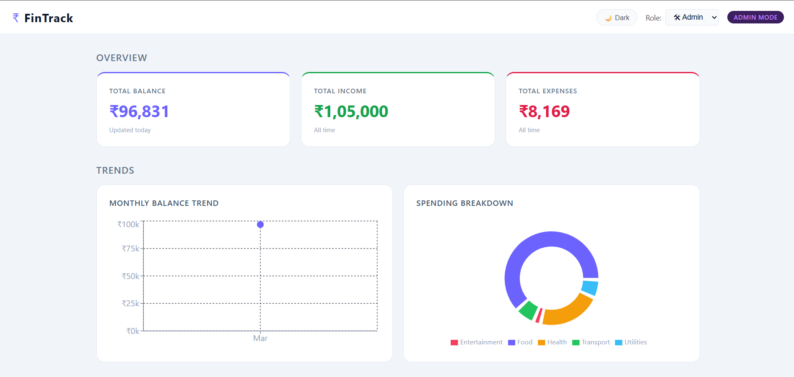
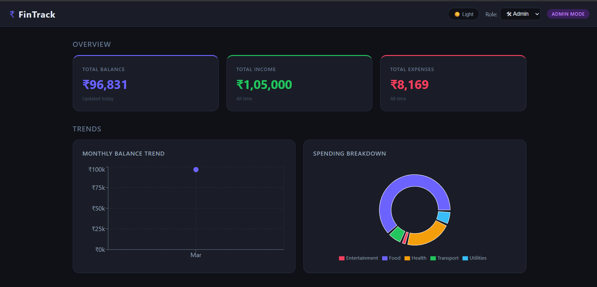
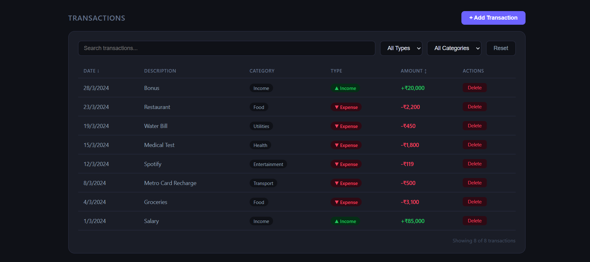
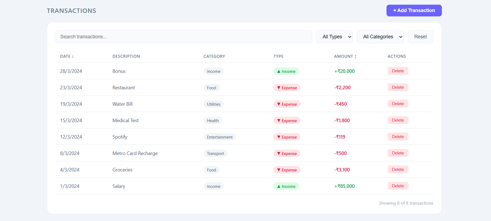

# Finance Dashboard

This is my submission for the Frontend Developer Intern assignment.
I built a finance dashboard where users can track their income,
expenses and get a basic overview of their spending habits.

---

## How to run it

Make sure you have Node.js installed, then:

npm install
npm run dev

It should open at http://localhost:5173

---

## What I used

- React with Vite
- Recharts for the charts
- Plain CSS for styling
- React Context for managing state

I kept it simple and avoided extra libraries where I could.

---

## What I built

**Dashboard**
The main page shows three summary cards for total balance, income
and expenses. Below that there are two charts — a line chart showing
how the balance changed each month and a donut chart breaking down
spending by category.

**Transactions**
There is a table showing all transactions with the date, description,
category, type and amount. You can search by name, filter by type or
category and sort by date or amount by clicking the column headers.

**Role based UI**
I added a dropdown in the navbar to switch between Viewer and Admin.
In Viewer mode everything is read only. In Admin mode you get a button
to add new transactions and a delete button on each row. I kept this
frontend only since no backend was required.

**Insights**
This section pulls out a few useful numbers from the data like the
top spending category, highest and lowest spending month, savings rate
and average monthly spending.

**Dark and Light mode**
There is a toggle in the navbar to switch themes. All colors are CSS
variables so the whole app transitions smoothly.

---

## Screenshots

### Light Mode

### Dark Mode

### Transactions

### Add Transaction Modal

---

## Folder structure

src/
├── components/       all UI components
├── context/          global state with React Context
├── data/             mock transaction data
├── index.css         all styles
└── App.jsx           main layout

---

## Notes

- All data is hardcoded and mock, no backend involved
- Role switching is simulated on the frontend only
- Amounts are in Indian Rupees
- Data resets on page refresh

---

## Assumptions I made

I assumed the role switching did not need any authentication and
could just be a simple dropdown for demo purposes. I also assumed
static data was fine since the brief said backend is not required.

---

Made by [Pankaj Takmoge]
